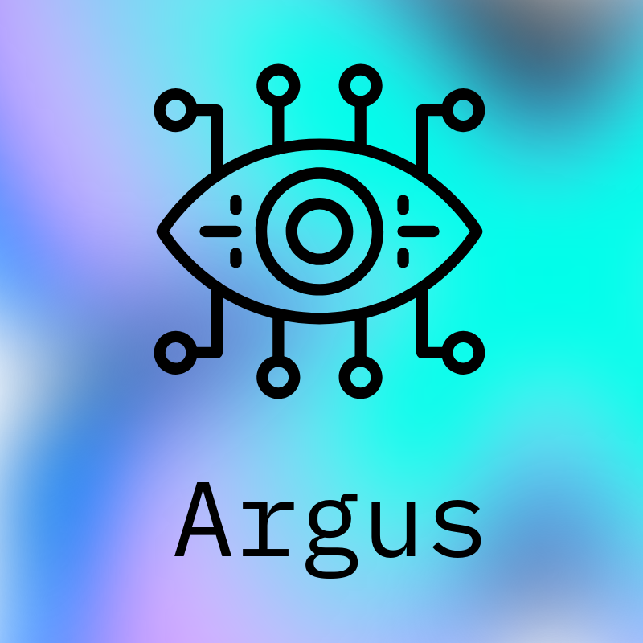

<p align="center">
  
</p>

# ArgusSDK — Shadow-AI Visibility Agent

> **Status: public beta — Windows-first.** Honest about what works today. The
> Windows agent detects cloud and local AI-tool usage and forwards it to your
> SIEM. Linux and macOS exist in the tree but are **not** verified or shipped
> yet (see [Capabilities](#capabilities)). This is an early, transparent
> release — contributions welcome via PRs.

---

## The gap

Engineering, support, and analyst teams are adopting AI tools faster than
security can see them — Copilot, Cursor, Windsurf/Codeium, Claude, ChatGPT,
Gemini, local models via Ollama, and dozens more. Most of this is **invisible**
to existing EDR/DLP: it looks like ordinary HTTPS to ordinary domains. Security
teams can't answer the basic question: *which AI services are our endpoints
actually talking to, and from which processes?*

**Argus exists to make that visible** — a lightweight endpoint agent that detects
AI-service access (by the hostname seen in DNS, plus local inference ports),
normalizes it to [OCSF](https://schema.ocsf.io/), and forwards it to the SIEM you
already run. It is deliberately **low-privilege and observe-only**: no process
enumeration, no file monitoring, no packet/content capture.

## What it is

A standalone, config-driven collection agent (mental model: NXLog/rsyslog, but
for AI-tool telemetry). It collects signals from two sources — an **EUC**
collector (Shadow-AI on endpoints) and a **gRPC ingest** listener (for the
Python/TypeScript instrumentation libraries) — and routes them to configured
outputs (Kafka, Splunk, Elastic, syslog, or ArgusXDR), translating to OCSF for
non-XDR destinations.

```
AI tool on endpoint ──DNS/port──▶ EUC collector ─┐
                                                  ├─▶ OCSF map ─▶ outputs[] ─▶ your SIEM
instrumented app ──gRPC──▶ ingest listener ──────┘        (WAL buffer on outage)
```

**Scope (by design).** Argus is **visibility only** — it surfaces *which* AI
services are in use, with process attribution. Acting on that (allow, alert, or
block) is done by the controls you **already run** — firewall, proxy/CASB, EDR,
MDM — consuming Argus's OCSF output. Argus deliberately stays observe-only and
low-privilege; enforcement is **not a goal** of this project, by design.

## Capabilities

Honest matrix — ✅ verified live, ⚠️ in-tree but unverified, ❌ not implemented.

| Capability | Windows | Linux | macOS |
|---|---|---|---|
| **Cloud AI detection** (Copilot/Cursor/Claude/Gemini/… by DNS hostname) | ✅ verified | ❌ not yet | ❌ not yet |
| **Local inference detection** (Ollama/LM Studio/vLLM ports) | ✅ verified | ⚠️ unverified | ⚠️ unverified |
| **Managed service install** | ✅ MSI (one-click / `msiexec /quiet`) | ⚠️ internal only | ⚠️ internal only |
| **Signal pipeline → SIEM (OCSF)** | ✅ verified to Kafka | (same code) | (same code) |
| **Output connectors** | Kafka ✅ live · Elastic/Splunk ✅ CI-tested · syslog/argusxdr ⚠️ unit-tested | | |
| **Process attribution on detections** | ✅ | ⚠️ | ⚠️ |
| **Supply-chain signing** (cosign + SLSA provenance) | ✅ | — | — |

What "verified" means here: run on a real host, observed end-to-end. For example
the agent detected `claude.exe → api.anthropic.com` and delivered it as an OCSF
`euc.ai_access` event to Kafka, with the originating process name.

## What it does NOT do yet

Being explicit so no one assumes coverage they don't have — the worst failure
mode for a security tool:

- **No cloud-AI detection on Linux or macOS.** The hostname match needs DNS
  capture (Windows uses the ETW DNS-Client provider); the Linux eBPF and macOS
  Network-Extension equivalents are **not implemented/verified**. On those
  platforms only local-inference ports may be seen, and that path is unverified.
- **Only the Kafka output is proven end-to-end through the agent.** Elastic and
  Splunk connectors pass integration tests in CI; the full ingest→route→deliver
  path has only been exercised live for Kafka. Treat the rest as beta.
- **Remote/XDR mode is mock-tested only** — never run against a live ArgusXDR.
- **Installers are unsigned** — expect SmartScreen/Gatekeeper prompts until
  code-signing certificates are configured.
- **Not load/scale tested** for large fleets.

## Install (Windows)

Download `argus-agent_<version>_windows_amd64.msi` from the
[latest release](https://github.com/kairos-dev-kairos-ecl/ArgusSDK/releases).

```powershell
# interactive, or silent for MDM/Intune:
msiexec /i argus-agent_<version>_windows_amd64.msi /quiet
```

The installer registers and starts the **argus-agent** Windows service
(auto-start), writes a default config to `C:\ProgramData\argus-agent\agent.yaml`,
and logs to `C:\ProgramData\argus-agent\logs\agent.log`. The default runs in
local mode (no credentials). Edit the config to add your output, then:

```powershell
Restart-Service argus-agent
```

> **Linux / macOS:** not published yet. The `.deb`/`.rpm`/systemd, launchd, and
> container assets live under `packaging/` and `deploy/` for testing and
> contributors, but are intentionally **not** in the release until verified.
> Build from source at your own risk: `go build ./cmd/argus-agent`.

## Configuration

The agent is driven by one YAML file. Full reference:
**[docs/CONFIGURATION.md](docs/CONFIGURATION.md)**. The essentials:

- **What to watch** — `ingest.euc.ai_endpoints` (added to a built-in catalog of
  common AI services) and `local_inference_ports`.
- **Where detections go** — `outputs[]` (Kafka/Splunk/Elastic/syslog/ArgusXDR;
  set `ocsf: true` to translate). **This — not the agent log — is where your
  detections end up.**
- **Agent's own log** — `logging.file` is diagnostics only.

## How it works

- **EUC collector** (`internal/collector/euc/`) — Windows uses ETW: the
  **DNS-Client** provider for hostname-based cloud-AI detection, plus a gopsutil
  sampler for local-inference ports. Linux (eBPF) and macOS (gopsutil sampler;
  Network Extension deferred) are present but unverified.
- **OCSF mapper** (`internal/ocsf/`) — translates signals to OCSF v1.3 for
  external destinations; ArgusXDR receives the native `ArgusSignal` proto.
- **Dispatcher + WAL buffer** — fans batches to outputs; persists to a
  write-ahead log during outages and drains on reconnect.
- **Observability** — `/healthz`, `/readyz`, Prometheus `/metrics`.

## Roadmap (the work to ship it fully)

In rough priority order. **Help wanted — see [Contributing](#contributing).**

1. **Linux cloud-AI detection** — DNS capture via eBPF, to reach Windows parity.
2. **macOS cloud-AI detection** — `NEDNSProxyProvider` Network Extension (needs
   signing/notarization) + a `.pkg` installer.
3. **End-to-end verification of every output** (Splunk/Elastic/syslog/ArgusXDR),
   not just Kafka.
4. **Coverage/health telemetry** — so operators can prove the agent is actually
   seeing traffic (avoid silent gaps).
5. **Code signing** (Authenticode + Apple notarization) and real-XDR validation.

## Contributing

This is an honest early-stage project and contributions are very welcome —
especially the roadmap items above. Please:

- Open an issue describing the change before large work.
- Submit focused **pull requests** with tests; CI (`go build`/`vet`/`test`,
  race, cross-compile) must pass.
- For a new platform detector or output, include an integration test and, where
  possible, evidence of a live run.

See [CONTRIBUTING.md](CONTRIBUTING.md) for build/test details and
[SECURITY.md](SECURITY.md) for vulnerability reporting.

## Relationship to ArgusXDR

ArgusSDK is a **sibling project**, not part of ArgusXDR. The only shared artifact
is the `ArgusSignal` protobuf schema (used for Mode-1 output). Do not import
XDR-internal packages from the SDK.

## Documentation & project

| | |
|---|---|
| Configuration & rules (YAML reference) | [docs/CONFIGURATION.md](docs/CONFIGURATION.md) |
| Release notes | [CHANGELOG.md](CHANGELOG.md) |
| Building & cutting a release | [docs/RELEASING.md](docs/RELEASING.md) |
| Contributing & local development | [CONTRIBUTING.md](CONTRIBUTING.md) |
| Security policy & disclosure | [SECURITY.md](SECURITY.md) |
| License | [Apache-2.0](LICENSE) |

## License

ArgusSDK is licensed under the [Apache License 2.0](LICENSE). © 2026 Kairos
Foundation. Contributions are accepted under the same license.
